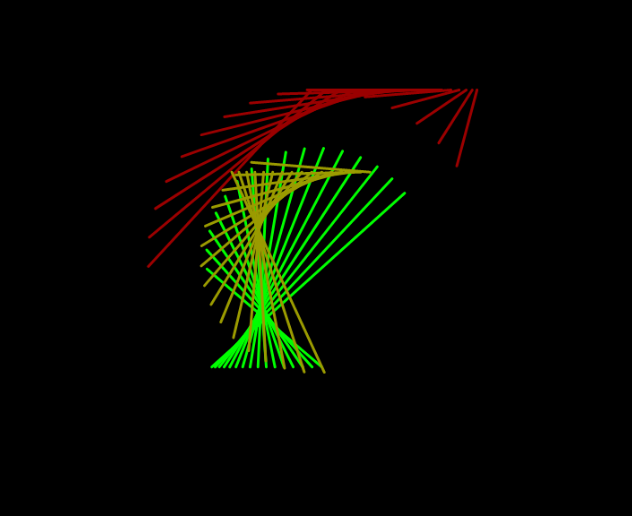

# dancing-lines
Some visulazations of dancing lines with sin() cos() and Perlin noise, inspired by the work of John Whitney

These dancing lines are made by plotting points in sine and cosine space  (t) around a unit circle.  The frequency and amplitude of are being modified, like this sin(t*frequency)*amplitude). Changes to the amplitude change the length of the line in the canvas. Changes in frequency can make the lines more or less vertical. Each group of colored lines are incremented differently (and some randomly) so they are out of phase. If they were in phase they would sit on top of each other and you could only see the last set drawn. 12 year old me would say it looks a lot like the 80s arcade game QIX. But now I see these type of visualizations were pioneered in the 60s by John Whitney. #creativecoding #p5js

[live with static amplitude](https://editor.p5js.org/greggelong/present/fD0xkweGJ)

lead by sine and cosine along the unit circle, first with a random amplitude and then a smooth Perlin noise amplitude. They have a mid 20th century vibe. And resemble a poor version of John Whitney's groundbreaking work. But this little study helps me improve my trigonometric fluency and visualizing a noise space. Also it's just fun to code and play with the parameters.

[live with perlin noise amplitude](https://editor.p5js.org/greggelong/present/OCijfputu)
