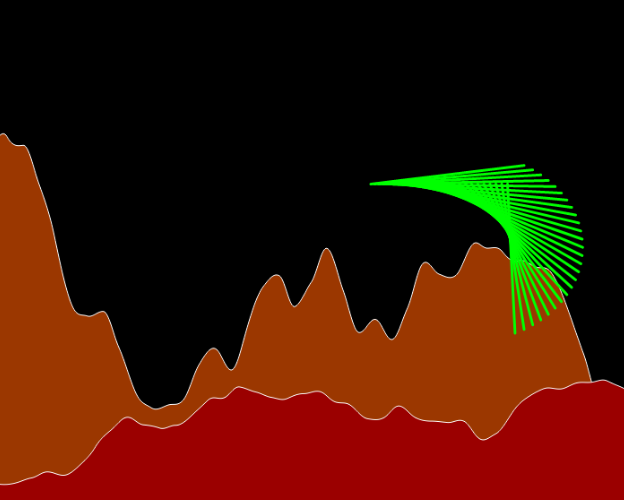

# dancing-lines
Some visualizations of dancing lines with sin() cos() and Perlin noise, inspired by the work of John Whitney

These dancing lines are made by plotting points in sine and cosine space  (t) around a unit circle.  The frequency and amplitude of are being modified, like this sin(t*frequency)*amplitude). Changes to the amplitude change the length of the line in the canvas. Changes in frequency can make the lines more or less vertical. Each group of colored lines are incremented differently (and some randomly) so they are out of phase. If they were in phase they would sit on top of each other and you could only see the last set drawn. 12 year old me would say it looks a lot like the 80s arcade game QIX. But now I see these type of visualizations were pioneered in the 60s by John Whitney. #creativecoding #p5js

[live with static amplitude](https://greggelong.github.io/dancing-lines/dancing-lines-staticAmp)

lead by sine and cosine along the unit circle, first with a random amplitude and then a smooth Perlin noise amplitude. They have a mid 20th century vibe. And resemble a poor version of John Whitney's groundbreaking work. But this little study helps me improve my trigonometric fluency and visualizing a noise space. Also it's just fun to code and play with the parameters.

[live with perlin noise amplitude](https://greggelong.github.io/dancing-lines/dancing-lines-PerlinNoiseAmp)

******************

this #p5js sketch is a combination of the last few. It is also an exploration of Perlin noise space and Sine and cosine space. And it is fitting that these create landscapes, because we can conceptualize noise values and trig values as a change in y over some time x, think of a sine wave. The mountains have been made that way but instead of a regular sine wave we get smooth random values up and down. The dancing lines are a combination of trig functions and noise. the lines are drawn from sine and cosine points around the unit circle. In this sketch the origin for the dancing lines is not tied to the center of the screen but moves in a random walk with smooth noise values over the canvas. I think this give the impression of some flying creature over an alien landscape. #creativecoding #generativeart #alienlandscape

[see it live at](https://greggelong.github.io/dancing-lines/dancing-lines-landscape/)

******************

Dancing lines with sliders to change the parameters, such as, number of lines, cosine and sine frequency for points x, y and x1,y1. The origin is a random walk of Perlin noise values. And the amplitude is also Perlin noise. It really gives the impression of 3d but is entirely on 2d canvas. 

[interact with it live](https://greggelong.github.io/dancing-lines/dancing-lines-slider)

**********************

Made the dancing lines into a class in p5.js and processing3 (java).  The class is called Whitney() and you can add as many to an array as you like untill you crash the browser or computer. 

[see it live at](https://greggelong.github.io/dancing-lines/whitneyClassDancingLines/)

**********************

Here a version with the canvas centered with CSS. And the canvas background color is HSB

<!-- [see it live at](https://editor.p5js.org/greggelong/present/Ppd9281I6) -->

<a href="https://greggelong.github.io/dancing-lines/whitneyClassBkgrndCSS" target="_blank">see it live at</a>

[home](https://greggelong.github.io/)
